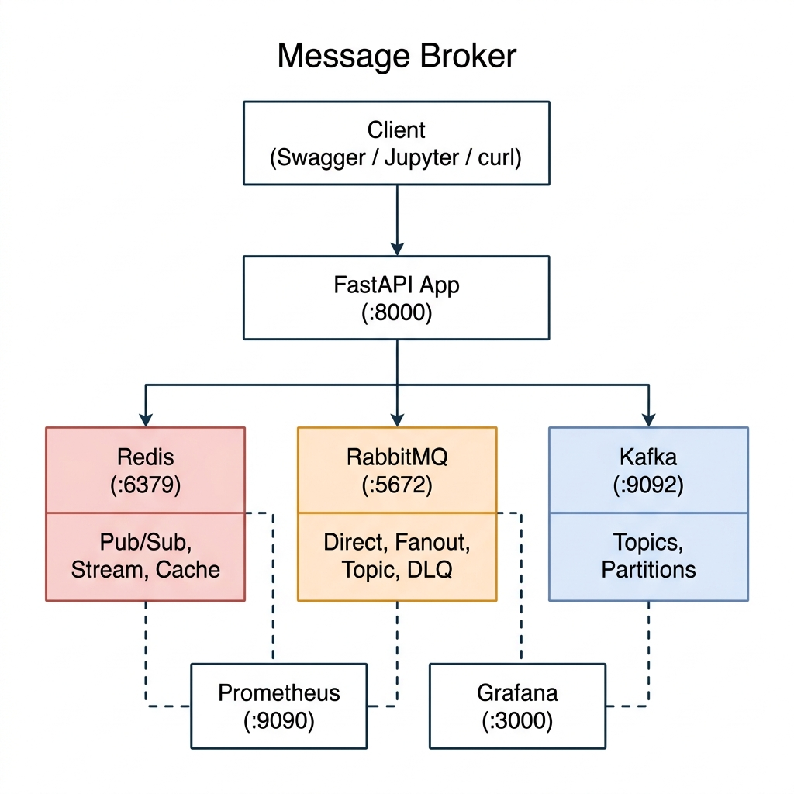
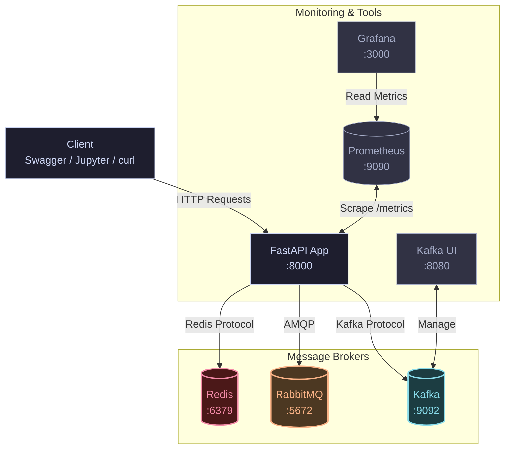
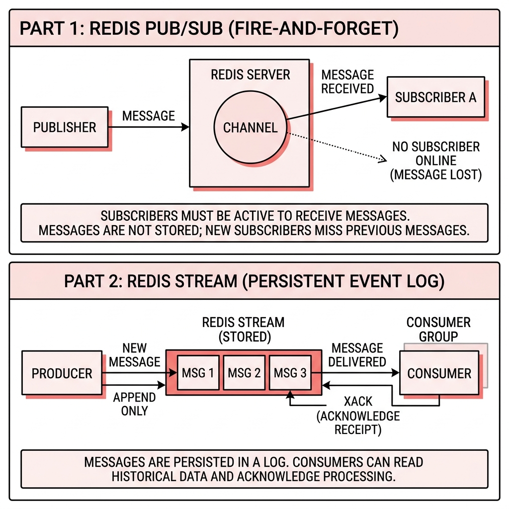
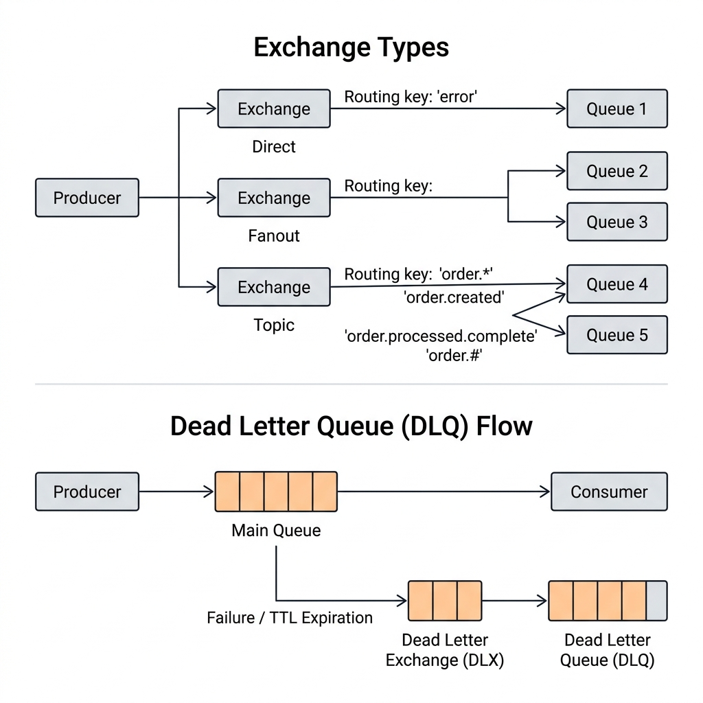
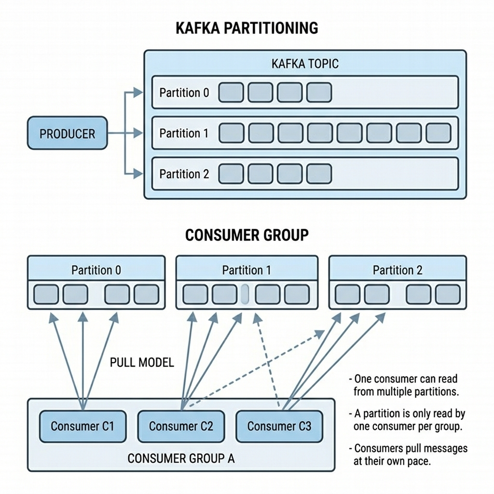

# Message Broker Comparison Lab

> Redis, RabbitMQ, Kafka의 **메시지 패턴, 성능, 아키텍처**를 실제 코드와 벤치마크로 비교 학습하는 프로젝트

<br>

## Table of Contents

- [아키텍처](#아키텍처)
- [빠른 시작](#빠른-시작)
- [핵심 개념 비교](#핵심-개념-비교)
- [Redis 기능 상세](#-redis-기능-상세)
- [RabbitMQ 기능 상세](#-rabbitmq-기능-상세)
- [Kafka 기능 상세](#-kafka-기능-상세)
- [API 엔드포인트 전체 목록](#api-엔드포인트-전체-목록)
- [벤치마크 가이드](#벤치마크-가이드)
- [모니터링 스택](#모니터링-스택)
- [Docker 학습 포인트](#docker-학습-포인트)
- [학습 로드맵](#학습-로드맵)
- [프로젝트 구조](#프로젝트-구조)
- [트러블슈팅](#트러블슈팅)

<br>

---

## 아키텍처






<br>

---

## 빠른 시작

### 1단계: 가상환경 세팅 (uv)

```bash
# uv 설치 (이미 있으면 생략)
curl -LsSf https://astral.sh/uv/install.sh | sh

# 의존성 설치 (자동으로 .venv 생성, 3초 이내)
uv sync
```

### 2단계: 인프라 실행 (Docker)

```bash
# 전체 인프라 (브로커 + 모니터링 + 앱)
docker compose up -d

# 또는 브로커만 (앱은 로컬에서 개발)
docker compose up redis rabbitmq kafka kafka-ui -d
```

### 3단계: 앱 실행

```bash
# 로컬 개발 모드 (hot-reload)
uv run python main.py
```

### 4단계: 테스트

```bash
# Swagger UI 열기
open http://localhost:8000/docs

# 또는 curl로 벤치마크 실행
curl -X POST http://localhost:8000/benchmark/all \
  -H "Content-Type: application/json" \
  -d '{"message_count": 1000}'
```

### 5단계: Jupyter 노트북

```bash
uv run jupyter lab
# → notebooks/01_project_overview.ipynb 열기
```

<br>

---

## 핵심 개념 비교

### 한눈에 보는 비교표

| 특성 | Redis | RabbitMQ | Kafka |
|:-----|:-----:|:--------:|:-----:|
| **프로토콜** | RESP | AMQP 0-9-1 | Kafka Protocol (TCP) |
| **메시지 모델** | Pub/Sub, Stream | Queue + Exchange | Distributed Log |
| **메시지 영속성** | Stream만 가능 | O (디스크) | O (디스크, 보존기간 설정) |
| **순서 보장** | Stream만 가능 | O (큐 내부) | O (파티션 내부) |
| **메시지 재처리** | Stream (offset) | NACK + Requeue | Offset Reset |
| **수평 확장** | Cluster/Sentinel | Consumer 추가 | Partition + Consumer Group |
| **Dead Letter** | X | O (DLX/DLQ) | 직접 구현 |
| **우선순위** | X | O (Priority Queue) | X |
| **메시지 TTL** | Stream (MAXLEN) | O (per-message, per-queue) | 보존기간 (전체) |
| **처리량** | 매우 높음 | 보통 | 매우 높음 |
| **레이턴시** | 매우 낮음 | 낮음 | 보통 |
| **운영 복잡도** | 낮음 | 보통 | 높음 |

### 메시지 전달 시퀀스

#### Redis (Pub/Sub vs Stream)



#### RabbitMQ (Smart Broker → Dumb Consumer & DLQ)



#### Kafka (Dumb Broker → Smart Consumer & Partitioning)




### 언제 무엇을 쓰나?

```
"1초 안에 도착하면 됨, 유실 OK"  →  Redis Pub/Sub
"반드시 처리되어야 함"           →  RabbitMQ (ACK + DLQ)
"순서대로 영구 보관"             →  Kafka (이벤트 로그)
"캐시가 필요함"                  →  Redis Cache
"작업 큐가 필요함"               →  Redis Queue / RabbitMQ
"요청 제한이 필요함"             →  Redis Rate Limiter
"이벤트 재처리가 필요함"         →  Redis Stream / Kafka
"대용량 실시간 스트리밍"         →  Kafka
```

<br>

---

## 🔴 Redis 기능 상세

### 지원하는 5가지 패턴

| # | 패턴 | Redis 명령 | 영속성 | 용도 |
|:-:|:-----|:-----------|:------:|:-----|
| 1 | **Pub/Sub** | PUBLISH / SUBSCRIBE | X | 실시간 알림, 캐시 무효화 |
| 2 | **Stream** | XADD / XREAD / XREADGROUP | O | 이벤트 소싱, 로그 수집 |
| 3 | **List Queue** | LPUSH / BRPOP | O | 작업 큐 (Celery 원리) |
| 4 | **Cache** | SET (EX) / GET | TTL | API 캐싱, 세션 관리 |
| 5 | **Rate Limiter** | ZADD / ZRANGEBYSCORE | TTL | API 속도 제한, DDoS 방어 |

### 패턴별 API

```bash
# ── Pub/Sub ──
POST /redis/pubsub/publish    # 채널에 메시지 발행

# ── Stream (Kafka-like) ──
POST /redis/stream/add        # 이벤트 추가 (XADD)
GET  /redis/stream/read       # 이벤트 읽기 (XREAD)
POST /redis/stream/group/create  # Consumer Group 생성
GET  /redis/stream/group/read    # Consumer Group으로 읽기
GET  /redis/stream/info          # 스트림 상세 정보

# ── List Queue ──
POST /redis/queue/push        # 작업 등록 (LPUSH)
GET  /redis/queue/pop         # 작업 가져오기 (BRPOP)
GET  /redis/queue/length      # 큐 길이 조회

# ── Cache ──
POST   /redis/cache/set       # 값 저장 (TTL 설정)
GET    /redis/cache/get/{key} # 값 조회 (hit/miss 확인)
DELETE /redis/cache/delete/{key}  # 캐시 무효화

# ── Rate Limiter ──
GET  /redis/ratelimit/check   # 요청 가능 여부 확인
```

<br>

---

## 🟠 RabbitMQ 기능 상세

### 지원하는 6가지 패턴

| # | 패턴 | Exchange 타입 | 용도 |
|:-:|:-----|:-------------|:-----|
| 1 | **Direct Queue** | Default (nameless) | 1:1 작업 분배 |
| 2 | **Fanout** | Fanout | 브로드캐스트 (모든 큐에 복제) |
| 3 | **Topic** | Topic | 라우팅 키 패턴 매칭 |
| 4 | **DLQ** | Fanout (DLX) | 실패 메시지 격리 |
| 5 | **Priority** | Default + x-max-priority | 우선순위 처리 |
| 6 | **TTL** | Default + expiration | 메시지 만료 정책 |

### Exchange 타입 동작 원리 및 DLQ 흐름


### 패턴별 API

```bash
# ── Direct ──
POST /rabbitmq/direct/publish        # 큐에 직접 전달
GET  /rabbitmq/queue/info/{name}     # 큐 상태 조회

# ── Fanout (브로드캐스트) ──
POST /rabbitmq/fanout/bind           # 큐를 Exchange에 바인딩
POST /rabbitmq/fanout/publish        # 모든 바인딩 큐에 전달

# ── Topic (패턴 라우팅) ──
POST /rabbitmq/topic/bind            # 패턴 키로 바인딩
POST /rabbitmq/topic/publish         # 라우팅 키로 선별 전달

# ── DLQ ──
POST /rabbitmq/dlq/setup             # DLQ 구성
GET  /rabbitmq/dlq/messages          # 실패 메시지 조회

# ── Priority ──
POST /rabbitmq/priority/publish      # 우선순위 메시지 (0~10)

# ── TTL ──
POST /rabbitmq/ttl/publish           # 만료 시간 있는 메시지
```

<br>

---

## 🔵 Kafka 기능 상세

### 지원하는 5가지 패턴

| # | 패턴 | 특징 | 용도 |
|:-:|:-----|:-----|:-----|
| 1 | **Basic Produce** | 자동 파티셔닝 (라운드로빈) | 기본 이벤트 발행 |
| 2 | **Keyed Produce** | key hash → 동일 파티션 보장 | 순서 보장 필요 시 |
| 3 | **Batch Produce** | send() + flush() 일괄 전송 | 대량 이벤트 |
| 4 | **Topic Management** | 토픽 생성/목록/상세 조회 | 인프라 관리 |
| 5 | **Consumer Group** | 병렬 소비 + offset 관리 | 수평 확장 |

### 파티셔닝 원리


### 패턴별 API

```bash
# ── Basic ──
POST /kafka/basic/publish           # 자동 파티셔닝 발행

# ── Keyed (순서 보장) ──
POST /kafka/keyed/publish           # 키 기반 파티셔닝

# ── Batch (대량 발행) ──
POST /kafka/batch/publish           # 일괄 발행

# ── Topic 관리 ──
POST /kafka/topic/create            # 토픽 생성
GET  /kafka/topics                  # 토픽 목록
GET  /kafka/topic/info/{topic}      # 토픽 상세 정보
```

<br>

---

## API 엔드포인트 전체 목록

### 서비스 URL

| 서비스 | URL | 용도 |
|:-------|:----|:-----|
| **Swagger UI** | http://localhost:8000/docs | API 인터랙티브 테스트 |
| **ReDoc** | http://localhost:8000/redoc | API 문서 (읽기 전용) |
| **Prometheus Metrics** | http://localhost:8000/metrics | 원시 메트릭 데이터 |
| **RabbitMQ Management** | http://localhost:15672 | 큐/Exchange 관리 (guest/guest) |
| **Kafka UI** | http://localhost:8080 | 토픽/메시지/Consumer 관리 |
| **Prometheus Dashboard** | http://localhost:9090 | 메트릭 쿼리 |
| **Grafana Dashboard** | http://localhost:3000 | 시각화 대시보드 (admin/admin) |

### 엔드포인트 요약 (30+ API)

| Method | Path | 설명 |
|:------:|:-----|:-----|
| GET | `/health` | 서비스 + 브로커 상태 |
| POST | `/api/direct` | 순수 API (baseline) |
| | | |
| POST | `/redis/pubsub/publish` | Redis Pub/Sub 발행 |
| POST | `/redis/stream/add` | Redis Stream 이벤트 추가 |
| GET | `/redis/stream/read` | Redis Stream 읽기 |
| POST | `/redis/stream/group/create` | Consumer Group 생성 |
| GET | `/redis/stream/group/read` | Consumer Group 읽기 |
| GET | `/redis/stream/info` | Stream 메타데이터 |
| POST | `/redis/queue/push` | List Queue 등록 |
| GET | `/redis/queue/pop` | List Queue 소비 |
| GET | `/redis/queue/length` | 큐 길이 |
| POST | `/redis/cache/set` | 캐시 저장 |
| GET | `/redis/cache/get/{key}` | 캐시 조회 |
| DELETE | `/redis/cache/delete/{key}` | 캐시 삭제 |
| GET | `/redis/ratelimit/check` | Rate Limit 확인 |
| | | |
| POST | `/rabbitmq/direct/publish` | Direct Queue 발행 |
| GET | `/rabbitmq/queue/info/{name}` | 큐 상태 조회 |
| POST | `/rabbitmq/fanout/bind` | Fanout 바인딩 |
| POST | `/rabbitmq/fanout/publish` | Fanout 발행 |
| POST | `/rabbitmq/topic/bind` | Topic 바인딩 |
| POST | `/rabbitmq/topic/publish` | Topic 발행 |
| POST | `/rabbitmq/dlq/setup` | DLQ 구성 |
| GET | `/rabbitmq/dlq/messages` | DLQ 메시지 조회 |
| POST | `/rabbitmq/priority/publish` | 우선순위 발행 |
| POST | `/rabbitmq/ttl/publish` | TTL 발행 |
| | | |
| POST | `/kafka/basic/publish` | Kafka 기본 발행 |
| POST | `/kafka/keyed/publish` | 키 기반 발행 |
| POST | `/kafka/batch/publish` | 배치 발행 |
| POST | `/kafka/topic/create` | 토픽 생성 |
| GET | `/kafka/topics` | 토픽 목록 |
| GET | `/kafka/topic/info/{topic}` | 토픽 상세 |
| | | |
| POST | `/benchmark/redis` | Redis Pub/Sub 벤치마크 |
| POST | `/benchmark/redis-stream` | Redis Stream 벤치마크 |
| POST | `/benchmark/rabbitmq` | RabbitMQ 벤치마크 |
| POST | `/benchmark/kafka` | Kafka 벤치마크 |
| POST | `/benchmark/kafka-batch` | Kafka Batch 벤치마크 |
| POST | `/benchmark/all` | 전체 비교 벤치마크 |
| GET | `/monitoring/comparison` | 벤치마크 비교 |
| GET | `/monitoring/history` | 지연시간 히스토리 |

<br>

---

## 벤치마크 가이드

### 벤치마크 실행

```bash
# 전체 비교 (5가지 방식, 각 1000개)
curl -X POST http://localhost:8000/benchmark/all \
  -H "Content-Type: application/json" \
  -d '{"message_count": 1000}'

# 대량 테스트 (10000개)
curl -X POST http://localhost:8000/benchmark/all \
  -H "Content-Type: application/json" \
  -d '{"message_count": 10000}'
```

### 예상 결과 패턴

```
처리량 (msg/s) 예상 순위:
━━━━━━━━━━━━━━━━━━━━━━━━━━━━━━━━
1위  Redis Pub/Sub    ~50,000+  (메모리, 영속성 없음)
2위  Kafka Batch      ~20,000+  (배치 최적화)
3위  Redis Stream     ~15,000+  (메모리, 영속성 있음)
4위  Kafka            ~5,000+   (디스크, 개별 ACK)
5위  RabbitMQ         ~3,000+   (디스크, ACK + 영속성)

레이턴시 (ms) 예상 순위:
━━━━━━━━━━━━━━━━━━━━━━━━━━━━━━━━
1위  Redis Pub/Sub    ~0.02ms
2위  Redis Stream     ~0.05ms
3위  Kafka Batch      ~0.05ms  (평균, 배치 기준)
4위  Kafka            ~0.5ms
5위  RabbitMQ         ~0.3ms
```

> 실제 수치는 하드웨어, Docker 리소스, 네트워크에 따라 달라집니다.

### Jupyter에서 시각화

```bash
uv run jupyter lab
# → notebooks/05_benchmark_and_visualization.ipynb 열기
# → 자동으로 차트 생성 + 비교 테이블
```

<br>

---

## 모니터링 스택

### Prometheus 메트릭

| 메트릭 | 타입 | 설명 |
|:-------|:----:|:-----|
| `broker_publish_latency_seconds` | Histogram | 발행 지연시간 |
| `broker_publish_total` | Counter | 발행 메시지 수 |
| `broker_consume_latency_seconds` | Histogram | 소비 지연시간 |
| `broker_consume_total` | Counter | 소비 메시지 수 |
| `http_request_duration_seconds` | Histogram | API 응답 시간 |

### Prometheus 쿼리 예시

```promql
# 브로커별 초당 발행 속도
rate(broker_publish_total[5m])

# 브로커별 99th percentile 지연시간
histogram_quantile(0.99, broker_publish_latency_seconds_bucket)

# API 엔드포인트별 요청 속도
rate(http_requests_total[5m])
```

### Grafana 대시보드 설정

1. http://localhost:3000 접속 (admin/admin)
2. Data Sources → Prometheus 추가 (URL: `http://prometheus:9090`)
3. Dashboard → Import → 쿼리 직접 작성

<br>

---

## Docker 학습 포인트

### Dockerfile 핵심

```dockerfile
# 1. Multi-stage build → 이미지 크기 최소화
FROM python:3.12-slim AS builder    # 빌드용 (큰 이미지)
FROM python:3.12-slim AS runtime    # 실행용 (가벼운 이미지)

# 2. Layer caching → 빌드 속도 최적화
COPY pyproject.toml uv.lock ./      # 의존성 먼저 (변경 적음)
RUN uv sync                         # 캐시됨!
COPY . .                            # 소스 코드 (변경 많음)

# 3. uv in Docker → pip 대비 10~100배 빠른 빌드
COPY --from=ghcr.io/astral-sh/uv:latest /uv /bin/

# 4. Healthcheck → 컨테이너 상태 모니터링
HEALTHCHECK CMD python -c "import httpx; httpx.get('...')"
```

### Docker Compose 핵심

```yaml
# 1. depends_on + healthcheck → 시작 순서 제어
depends_on:
  redis:
    condition: service_healthy  # 헬스체크 통과 후 시작

# 2. KRaft 모드 → Zookeeper 없는 Kafka
KAFKA_CFG_PROCESS_ROLES: controller,broker

# 3. Volume → 데이터 영속성
volumes:
  - redis_data:/data

# 4. 네트워크 → DNS 기반 서비스 디스커버리
REDIS_HOST: redis  # 컨테이너 이름으로 접근
```

### 유용한 Docker 명령어

```bash
# 상태 확인
docker compose ps
docker compose logs -f redis         # 특정 서비스 로그

# 리소스 확인
docker stats                          # CPU/메모리 실시간

# 개별 서비스 재시작
docker compose restart kafka

# 전체 정리 (데이터 포함)
docker compose down -v

# 앱만 리빌드
docker compose up -d --build app
```

<br>

---

## 학습 로드맵

### Phase 1: 기본 이해 (Day 1) — 노트북 01~04

```
📓 01_project_overview.ipynb        → 프로젝트 전체 구조 파악
📓 02_redis_deep_dive.ipynb         → Redis 5가지 패턴 실습
📓 03_rabbitmq_deep_dive.ipynb      → RabbitMQ 6가지 패턴 실습
📓 04_kafka_deep_dive.ipynb         → Kafka 5가지 패턴 실습

1. docker compose up -d 실행
2. http://localhost:8000/docs 에서 Swagger 열기
3. 각 브로커별 publish API 호출해보기
   - /api/direct         → 기준선 확인
   - /redis/pubsub/publish → 가장 빠름
   - /rabbitmq/direct/publish → ACK 확인
   - /kafka/basic/publish     → partition, offset 확인
4. /benchmark/all 실행 → 성능 차이 체감
```

### Phase 2: 벤치마크 & 모니터링 (Day 2-3) — 노트북 05~06

```
📓 05_benchmark_and_visualization.ipynb → 벤치마크 시각화 + 성능 비교
📓 06_monitoring_and_aop.ipynb          → Prometheus + Grafana 모니터링

1. Jupyter 노트북으로 벤치마크 시각화
2. Prometheus에서 메트릭 쿼리 연습
3. Grafana 대시보드 구성
4. 메시지 수별 성능 변화 관찰 (100 → 1000 → 10000)
```

### Phase 3: 고급 패턴 (Day 4-5) — 노트북 07~10

```
📓 07_advanced_patterns.ipynb           → DLQ, Priority, TTL 고급 패턴
📓 08_reliability_patterns.ipynb        → 신뢰성 패턴 (재시도, 멱등성)
📓 09_concurrency_and_distribution.ipynb → 동시성 제어 + 분산 락
📓 10_delayed_messages_and_saga.ipynb    → 지연 메시지 + Saga 패턴 입문

1. RabbitMQ DLQ/Priority/TTL 패턴 심화
2. Redis 분산 Lock, Semaphore 패턴
3. Kafka Consumer Group 병렬 처리
4. Saga 패턴 기초 이해
```

### Phase 4: Docker 심화 (Day 6)

```
1. Dockerfile 분석 (multi-stage, layer caching)
2. docker compose 설정 분석 (healthcheck, depends_on)
3. docker stats로 리소스 모니터링
4. docker compose scale kafka=3 (Kafka 클러스터링)
5. Volume 마운트와 데이터 영속성 실험
```

### Phase 5: 실전 과제 (Day 7-10) — 노트북 11~17 🔥

```
📓 11_challenge_payment.ipynb           → ⭐⭐⭐⭐   결제 처리 (Rate Limit + Priority + 분산 Lock)
📓 12_challenge_ticket_booking.ipynb    → ⭐⭐⭐⭐   티켓 예매 (Redis Stream + Consumer Group + Lua)
📓 13_challenge_group_chat.ipynb        → ⭐⭐⭐     그룹 채팅 (Pub/Sub + Stream + Topic 멘션)
📓 14_challenge_bulk_processing.ipynb   → ⭐⭐⭐     대용량 처리 (Kafka Batch + Redis Pipeline 벤치마크)
📓 15_challenge_saga_order.ipynb        → ⭐⭐⭐⭐⭐ Saga 패턴 (주문→결제→재고→배송 + 보상 트랜잭션)
📓 16_challenge_realtime_delivery.ipynb → ⭐⭐⭐     실시간 배달 알림 (TTL+DLX 지연 + Topic 라우팅)
📓 17_challenge_image_pipeline.ipynb    → ⭐⭐⭐⭐⭐ 이미지 파이프라인 (Python + Go 하이브리드)

실전 과제는 Mock 데이터(data/mock/)를 사용하여
실무와 동일한 시나리오를 재현합니다.
```

<br>

---

## 프로젝트 구조

```
kafkaRabbitTest/
├── main.py                          # FastAPI 앱 엔트리포인트
├── pyproject.toml                   # uv 의존성 (Python 3.12)
├── uv.lock                          # 잠금 파일
├── Dockerfile                       # Multi-stage build (uv)
├── docker-compose.yml               # 8개 서비스 오케스트레이션
├── .dockerignore                    # Docker 빌드 제외
├── .env                             # 환경 변수
├── .gitignore
│
├── app/
│   ├── __init__.py
│   ├── config.py                    # pydantic-settings 설정
│   │
│   ├── api/
│   │   ├── __init__.py
│   │   └── routes.py                # 30+ API 엔드포인트
│   │
│   ├── brokers/
│   │   ├── __init__.py
│   │   ├── redis_broker.py          # 5패턴: Pub/Sub, Stream, Queue, Cache, Rate Limiter
│   │   ├── rabbitmq_broker.py       # 6패턴: Direct, Fanout, Topic, DLQ, Priority, TTL
│   │   └── kafka_broker.py          # 5패턴: Basic, Keyed, Batch, Topic Mgmt, Consumer
│   │
│   └── monitoring/
│       ├── __init__.py
│       └── metrics.py               # Prometheus + 벤치마크 수집기
│
├── image-processor/                 # 🆕 Go 이미지 처리 마이크로서비스
│   ├── Dockerfile                   # Multi-stage build (golang:1.22 → alpine)
│   ├── go.mod
│   ├── cmd/
│   │   └── main.go                  # RabbitMQ Consumer + HTTP /health + /metrics
│   └── internal/
│       ├── handler/
│       │   └── image.go             # 이미지 리사이즈/압축/필터 로직
│       └── config/
│           └── config.go            # 환경변수 설정
│
├── data/mock/                       # 🆕 실전 과제용 Mock 데이터
│   ├── payments.json                # 결제 100건 (VIP 20 + NORMAL 80)
│   ├── tickets.json                 # 예매 200건, 콘서트 50석
│   ├── chat_messages.json           # 채팅 200건, 3개 방
│   ├── bulk_orders.json             # 주문 1000건 (벤치마크용)
│   ├── saga_orders.json             # Saga 성공/실패 시나리오
│   ├── delivery_timeline.json       # 배달 4단계 타임라인
│   └── images_metadata.json         # 이미지 처리 요청 50건
│
├── infra/
│   └── prometheus.yml               # Prometheus scrape 설정
│
├── notebooks/                       # 📓 학습 노트북 (10개) + 실전 과제 (7개)
│   ├── 01_project_overview.ipynb           # 프로젝트 전체 구조
│   ├── 02_redis_deep_dive.ipynb            # Redis 심화
│   ├── 03_rabbitmq_deep_dive.ipynb         # RabbitMQ 심화
│   ├── 04_kafka_deep_dive.ipynb            # Kafka 심화
│   ├── 05_benchmark_and_visualization.ipynb # 벤치마크 시각화
│   ├── 06_monitoring_and_aop.ipynb         # 모니터링
│   ├── 07_advanced_patterns.ipynb          # 고급 패턴
│   ├── 08_reliability_patterns.ipynb       # 신뢰성 패턴
│   ├── 09_concurrency_and_distribution.ipynb # 동시성 & 분산
│   ├── 10_delayed_messages_and_saga.ipynb  # 지연 메시지 & Saga
│   ├── 11_challenge_payment.ipynb          # 🔥 결제 처리 과제
│   ├── 12_challenge_ticket_booking.ipynb   # 🔥 티켓 예매 과제
│   ├── 13_challenge_group_chat.ipynb       # 🔥 그룹 채팅 과제
│   ├── 14_challenge_bulk_processing.ipynb  # 🔥 대용량 처리 과제
│   ├── 15_challenge_saga_order.ipynb       # 🔥 Saga 주문 과제
│   ├── 16_challenge_realtime_delivery.ipynb # 🔥 실시간 배달 과제
│   └── 17_challenge_image_pipeline.ipynb   # 🔥 이미지 파이프라인 (Go 연동)
│
├── test_api.http                    # REST Client 테스트 파일
└── .vscode/
    └── extensions.json              # 추천 Extension 목록
```

<br>

---

## 트러블슈팅

### Kafka 시작이 느림

```bash
# Kafka는 초기 시작에 30~60초 소요 (KRaft 초기화)
docker compose logs -f kafka
# "Kafka Server started" 메시지 확인 후 앱 실행
```

### RabbitMQ 연결 거부

```bash
# RabbitMQ 헬스체크 상태 확인
docker compose ps rabbitmq
# healthy 상태가 될 때까지 대기 (약 15~30초)
```

### 포트 충돌

```bash
# 사용 중인 포트 확인
lsof -i :8000   # FastAPI
lsof -i :6379   # Redis
lsof -i :5672   # RabbitMQ
lsof -i :9092   # Kafka
```

### Docker 메모리 부족

```bash
# Docker Desktop → Settings → Resources
# 최소 4GB RAM 권장 (Kafka가 메모리를 많이 사용)
```

### uv sync 실패

```bash
# Python 3.13 필요
uv python install 3.13
uv sync
```