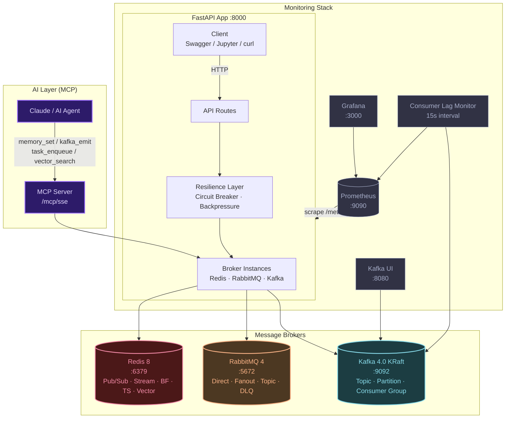
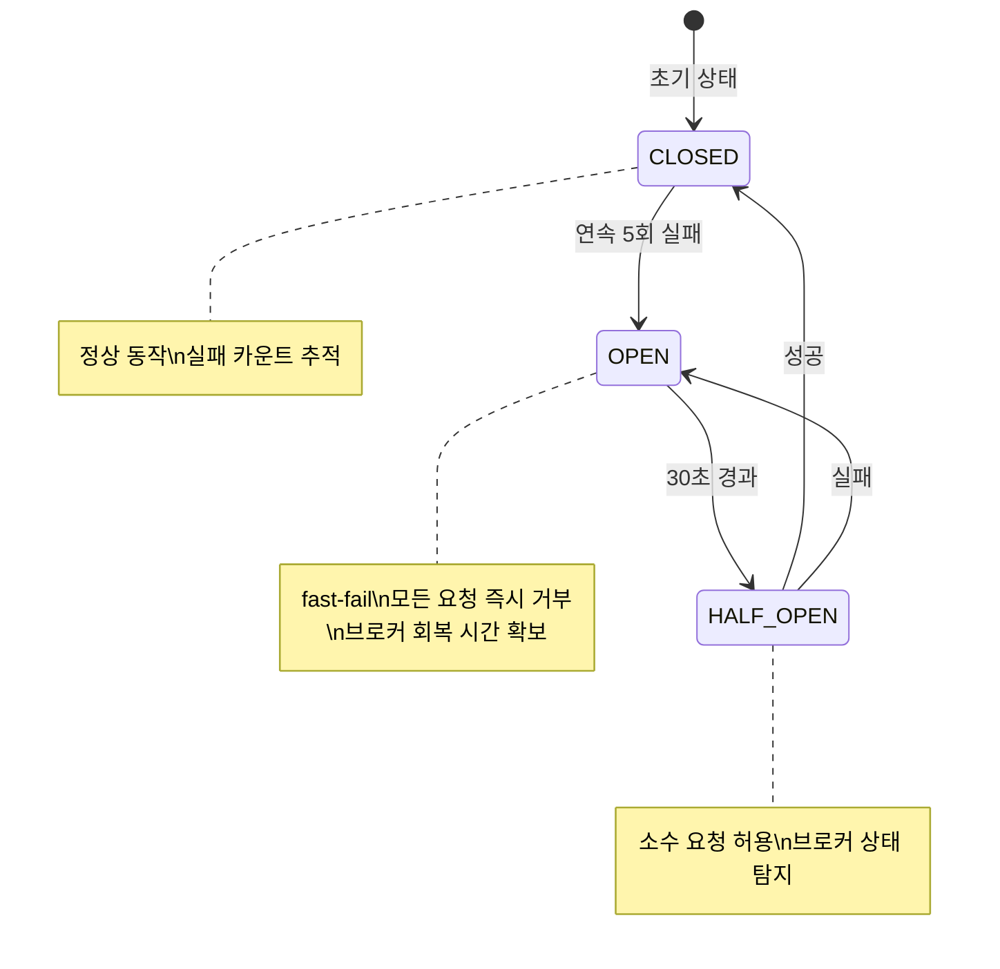
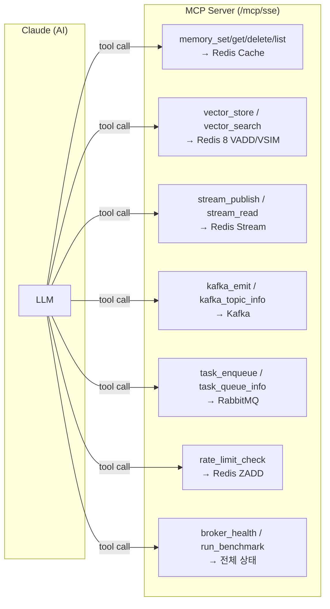

# Message Broker Comparison Lab

> Redis · RabbitMQ · Kafka의 **메시지 패턴, 성능, 아키텍처**를 코드와 수치로 직접 비교하고,  
> **MCP로 AI가 브로커를 직접 제어**하며, **Circuit Breaker / Backpressure**로 프로덕션 패턴까지 학습하는 종합 실습 환경

<br>

## Table of Contents

- [전체 아키텍처](#전체-아키텍처)
- [빠른 시작](#빠른-시작)
- [핵심 개념 비교](#핵심-개념-비교)
- [Redis 기능 상세](#-redis-기능-상세)
- [RabbitMQ 기능 상세](#-rabbitmq-기능-상세)
- [Kafka 기능 상세](#-kafka-기능-상세)
- [프로덕션 패턴](#프로덕션-패턴-circuit-breaker--backpressure--consumer-lag)
- [MCP — AI가 브로커를 직접 제어](#mcp--ai가-브로커를-직접-제어)
- [API 엔드포인트 전체 목록](#api-엔드포인트-전체-목록)
- [벤치마크 가이드](#벤치마크-가이드)
- [모니터링 스택](#모니터링-스택)
- [학습 로드맵](#학습-로드맵)
- [프로젝트 구조](#프로젝트-구조)
- [트러블슈팅](#트러블슈팅)

<br>

---

## 전체 아키텍처




<br>

---

## 빠른 시작

### 1단계: 의존성 설치

```bash
# uv 설치 (이미 있으면 생략)
curl -LsSf https://astral.sh/uv/install.sh | sh

# 의존성 설치 (mcp, numpy 포함)
uv sync
```

### 2단계: 인프라 실행

```bash
# 전체 인프라 (브로커 + 모니터링 + 앱)
docker compose up -d

# 또는 브로커만 (앱은 로컬에서 개발)
docker compose up redis rabbitmq kafka kafka-ui -d
```

### 3단계: 앱 실행

```bash
uv run python main.py
```

시작 시 다음 엔드포인트가 출력됩니다:

```
📋 Swagger UI:        http://localhost:8000/docs
📊 Prometheus:        http://localhost:8000/metrics
🔗 MCP SSE:           http://localhost:8000/mcp/sse        ← AI 연동
🛡  Circuit Breakers:  http://localhost:8000/resilience/circuit-breakers
```

### 4단계: MCP로 Claude에 연결 (선택)

이 디렉토리의 `.claude/settings.json`이 이미 설정되어 있습니다. 앱 실행 후 Claude Code가 자동으로 15개 브로커 도구를 인식합니다.

```json
// .claude/settings.json (자동 생성됨)
{
  "mcpServers": {
    "broker-lab": {
      "type": "sse",
      "url": "http://localhost:8000/mcp/sse"
    }
  }
}
```

### 5단계: Jupyter 노트북

```bash
uv run jupyter lab
# → notebooks/01_project_overview.ipynb 부터 시작
```

<br>

---

## 핵심 개념 비교

### 한눈에 보는 비교표

| 특성 | Redis | RabbitMQ | Kafka |
|:-----|:-----:|:--------:|:-----:|
| **프로토콜** | RESP3 | AMQP 0-9-1 | Kafka Wire Protocol |
| **메시지 모델** | Pub/Sub, Stream, Queue | Exchange + Queue | Distributed Commit Log |
| **메시지 영속성** | Stream만 가능 | O (디스크, durable) | O (보존기간 설정) |
| **순서 보장** | Stream만 가능 | 큐 내부 O | 파티션 내부 O |
| **메시지 재처리** | Stream (offset reset) | NACK + Requeue | Offset 재설정 |
| **수평 확장** | Cluster / Sentinel | Consumer 추가 | Partition + Consumer Group |
| **Dead Letter** | X | O (DLX/DLQ) | 직접 구현 |
| **우선순위** | X | O (x-max-priority) | X |
| **처리량** | 매우 높음 | 보통 | 매우 높음 |
| **레이턴시** | 0.01~0.1ms | 0.3~1ms | 0.5~5ms |
| **운영 복잡도** | 낮음 | 보통 | 높음 |
| **특수 자료구조** | Bloom Filter, TimeSeries, Vector Set | X | X |

### 메시지 전달 시퀀스

#### Redis — 다중 패턴 (Pub/Sub vs Stream vs Queue)


#### RabbitMQ — Smart Broker + Exchange 라우팅


#### Kafka — Dumb Broker + Smart Consumer + Partitioning


### 언제 무엇을 쓰나?

```
상황                              → 선택
─────────────────────────────────────────────────────
"1초 안에 도착하면 됨, 유실 OK"    → Redis Pub/Sub
"반드시 처리되어야 함"              → RabbitMQ (ACK + DLQ)
"순서대로 영구 보관"               → Kafka (Commit Log)
"캐시가 필요함"                    → Redis Cache (TTL SET/GET)
"중복 제거가 필요함"               → Redis Bloom Filter
"시계열 메트릭 저장"               → Redis TimeSeries
"AI 시맨틱 검색"                   → Redis Vector Set (VADD/VSIM)
"작업 큐"                         → Redis List Queue / RabbitMQ Direct
"요청 제한"                        → Redis Rate Limiter (ZADD Sliding Window)
"이벤트 재처리"                    → Redis Stream / Kafka Consumer Group
"대용량 실시간 스트리밍"            → Kafka Batch + linger_ms 튜닝
"AI Agent 메모리"                  → Redis via MCP (memory_set/get)
```

<br>

---

## 🔴 Redis 기능 상세

### 지원 패턴 (8가지)

| # | 패턴 | 핵심 명령어 | 영속성 | 용도 |
|:-:|:-----|:-----------|:------:|:-----|
| 1 | **Pub/Sub** | PUBLISH / SUBSCRIBE | X | 실시간 알림, 캐시 무효화 |
| 2 | **Stream** | XADD / XREAD / XREADGROUP | O | 이벤트 소싱, LLM 토큰 스트리밍 |
| 3 | **List Queue** | LPUSH / BRPOP | O | 작업 큐 (Celery 원리) |
| 4 | **Cache** | SET (EX) / GET | TTL | API 캐싱, AI 응답 캐시 |
| 5 | **Rate Limiter** | ZADD / ZRANGEBYSCORE | TTL | API 속도 제한 (슬라이딩 윈도우) |
| 6 | **Bloom Filter** | SETBIT / GETBIT (BITFIELD 기반) | O | 메시지 중복 처리 방지 |
| 7 | **TimeSeries** | ZADD / ZRANGEBYSCORE (SortedSet 기반) | O | 브로커 메트릭, AI 사용량 추적 |
| 8 | **Vector Set** | VADD / VSIM (Redis 8.0+) | O | 시맨틱 검색, RAG, AI 메모리 |

### Redis 8 신기능: Bloom Filter

확률적 자료구조. **false positive 가능, false negative 절대 불가.**  
Redis Stack 모듈 없이 표준 `SETBIT`으로 구현 — 어떤 Redis에서도 동작.

```
ADD("order-12345") → 3개 해시 함수 → 3개 비트 위치에 1 세팅

EXISTS("order-12345") → 3개 비트 모두 1? → "있을 수도 있음"
EXISTS("order-99999") → 비트 중 하나라도 0 → "확실히 없음" ← 100% 신뢰
```

```bash
# 사용 예: 결제 중복 처리 방지
POST /redis/bloom/add    {"filter_key": "paid-orders", "item": "order-12345"}
POST /redis/bloom/exists {"filter_key": "paid-orders", "item": "order-12345"}
GET  /redis/bloom/info/paid-orders
```

### Redis 8 신기능: TimeSeries

Sorted Set의 score=타임스탬프(ms) 구조로 시계열 데이터 저장.  
Redis TimeSeries 모듈 없이 동작 — 보존 정책(TRIM)과 범위 조회 지원.

```bash
# AI 응답 시간 추적
POST /redis/ts/add         {"series_key": "ai.latency.ms", "value": 234.5}
GET  /redis/ts/latest/ai.latency.ms?n=10   # 최근 10개
GET  /redis/ts/range/ai.latency.ms?from_ms=...&to_ms=...
DELETE /redis/ts/trim/ai.latency.ms?max_age_seconds=86400  # 1일 이후 삭제
```

### Redis 8 신기능: Vector Set (VADD / VSIM)

Redis 8.0에서 네이티브로 추가된 코사인 유사도 검색. RAG와 AI 시맨틱 메모리의 핵심.

```
문서 색인 (VADD):
  "Kafka는 분산 로그..." → 임베딩 모델 → [0.23, -0.45, 0.12, ...] → Redis VADD

쿼리 검색 (VSIM):
  "메시지 처리" → 임베딩 → VSIM → 코사인 유사도 Top-K 반환
```

```bash
POST /redis/vector/add    {"vset_key": "ai:memories", "element_id": "doc_001", "vector": [...]}
POST /redis/vector/search {"vset_key": "ai:memories", "query_vector": [...], "top_k": 5}
```

> **Notebook 18, 19**: 실제 임베딩 + RAGChain 연동 실습

<br>

---

## 🟠 RabbitMQ 기능 상세

### 지원 패턴 (6가지)

| # | 패턴 | Exchange 타입 | 용도 |
|:-:|:-----|:-------------|:-----|
| 1 | **Direct Queue** | Default (nameless) | 1:1 작업 분배, AI Task 큐 |
| 2 | **Fanout** | Fanout | 브로드캐스트 (모든 서비스에 복제) |
| 3 | **Topic** | Topic | 라우팅 키 패턴 매칭 (order.*, log.error) |
| 4 | **DLQ** | Fanout (DLX) | 실패 메시지 격리 + 재처리 |
| 5 | **Priority Queue** | Default + x-max-priority | VIP 우선 처리 |
| 6 | **TTL** | Default + expiration | 시간 제한 메시지 (OTP, 임시 토큰) |

### Exchange 라우팅 원리

```
Direct:  Producer → [Default Exchange] → "queue-name" → Consumer
Fanout:  Producer → [Fanout Exchange]  → Queue A, Queue B, Queue C (모두)
Topic:   Producer → [Topic Exchange]   → "order.*" → Queue A
                                       → "log.#"   → Queue B
```

### DLQ (Dead Letter Queue) 흐름

```
정상 흐름:
  Producer → [main-queue] → Consumer → ACK → 완료

실패 흐름 (NACK 또는 TTL 초과):
  Consumer → NACK → [main-queue] → DLX 라우팅 → [main-queue.dlq]
                                                        ↓
                                              재처리 또는 알람
```

<br>

---

## 🔵 Kafka 기능 상세

### 지원 패턴 (5가지)

| # | 패턴 | 특징 | 용도 |
|:-:|:-----|:-----|:-----|
| 1 | **Basic Produce** | 라운드로빈 파티셔닝 | 기본 이벤트 발행 |
| 2 | **Keyed Produce** | key hash → 동일 파티션 | 순서 보장 (사용자별, 주문별) |
| 3 | **Batch Produce** | send() 누적 + flush() | 대용량 로그, AI 임베딩 배치 |
| 4 | **Topic Management** | Admin Client | 토픽 생성/조회/파티션 관리 |
| 5 | **Consumer Group** | offset 기반 병렬 소비 | 수평 확장, 재처리 |

### Kafka 4.0 KRaft — ZooKeeper 완전 제거

```
[기존 Kafka 3.x]                    [Kafka 4.0 KRaft]
ZooKeeper 클러스터 (별도)             없음 (내장 Raft 합의)
  ↓                                   ↓
Kafka Broker ─ ZK 의존               Kafka Broker (Controller 내장)

장점: 배포 단순화, 컨트롤러 장애 복구 시간 단축 (초 → ms)
```

### Producer 튜닝 파라미터

```python
# 현재 설정 (app/brokers/kafka_broker.py)
AIOKafkaProducer(
    linger_ms=5,              # 5ms 대기 후 배치 전송 (처리량 ↑)
    max_batch_size=16384,     # 16KB 배치 크기
    compression_type="gzip",  # 네트워크 부하 ↓
)

# 고처리량 튜닝 (노트북 20에서 비교 실험)
AIOKafkaProducer(
    linger_ms=10,             # linger 더 길게 → 배치 더 큼
    max_batch_size=65536,     # 64KB → 4x 효율
    compression_type="lz4",   # CPU 효율 최고
)
```

<br>

---

## 프로덕션 패턴: Circuit Breaker · Backpressure · Consumer Lag

### Circuit Breaker — 연쇄 장애 방지

브로커 장애 시 연쇄 실패(Cascading Failure)를 격리. 장애가 전체 시스템으로 전파되는 것을 막음.



```bash
# 브로커별 Circuit Breaker 상태 조회
GET  /resilience/circuit-breakers
GET  /resilience/circuit-breakers/kafka

# 강제 리셋 (장애 해소 후)
POST /resilience/circuit-breakers/redis/reset
```

**Prometheus 메트릭:**
```promql
# Circuit Breaker 상태 (0=CLOSED, 1=HALF_OPEN, 2=OPEN)
circuit_breaker_state{broker="kafka"}

# 상태 전환 횟수
rate(circuit_breaker_transitions_total[5m])

# 차단된 요청 수
rate(circuit_breaker_rejections_total[1m])
```

### Backpressure — 과부하 자동 조절

처리 속도보다 요청이 빠를 때 슬롯이 빌 때까지 대기하고, 한계 초과 시 즉시 503 반환.

```
요청 도착
    ↓
[대기 중인 요청 수 확인]
    ├─ max_waiting 초과? → 즉시 503 (backpressure)
    └─ 가능 → 슬롯 대기
                ↓
        [Semaphore 획득 대기]
            ├─ timeout 초과? → 503 (backpressure_timeout)
            └─ 획득 → 처리 시작
                        ↓
                    [완료 → 슬롯 반환]
```

```bash
# Backpressure 상태 조회 (active/waiting 요청 수)
GET /resilience/backpressure
```

**브로커별 동시성 한도:**
| 브로커 | max_concurrent | max_waiting |
|:-------|:--------------:|:-----------:|
| Redis | 100 | 200 |
| RabbitMQ | 50 | 100 |
| Kafka | 30 | 60 |

**Prometheus 메트릭:**
```promql
# 현재 처리 중인 요청
backpressure_active_requests{broker="kafka"}

# 슬롯 대기 중인 요청
backpressure_waiting_requests{broker="redis"}

# 슬롯 대기 P99 시간
histogram_quantile(0.99, backpressure_wait_seconds_bucket)
```

### Consumer Lag — Kafka 처리 지연 모니터링

앱 시작 시 자동으로 15초 간격 백그라운드 모니터링 시작.  
**Lag = End Offset − Committed Offset**

```
Lag = 0      → Consumer가 실시간으로 따라잡음  ✅
Lag ↑        → Consumer 처리 속도 부족 신호   ⚠️
Lag > 10,000 → 🚨 즉시 대응 필요
```

```promql
# 토픽별 Consumer Group 전체 Lag
kafka_consumer_group_lag_sum{group="test-group", topic="test-topic"}

# 파티션별 세부 Lag
kafka_consumer_group_lag{group="test-group", topic="test-topic", partition="0"}
```

모니터링할 Consumer Group 추가 (런타임):
```python
from app.monitoring.kafka_lag import register_consumer_group
register_consumer_group("my-group", "my-topic")
```

<br>

---

## MCP — AI가 브로커를 직접 제어

> **핵심 아이디어**: 브로커 랩이 단순 학습 환경을 넘어 Claude/AI 에이전트의 실제 인프라 도구가 됩니다.

### MCP 서버 아키텍처



### 15개 MCP 도구 목록

| 카테고리 | 도구 이름 | 설명 |
|:---------|:---------|:-----|
| **메모리** | `memory_set` | Redis에 AI 컨텍스트 저장 (TTL 지원) |
| **메모리** | `memory_get` | Redis에서 AI 컨텍스트 조회 |
| **메모리** | `memory_delete` | 특정 메모리 삭제 |
| **메모리** | `memory_list` | 패턴으로 메모리 키 목록 조회 |
| **벡터** | `vector_store` | 텍스트 + 임베딩 벡터를 Redis에 저장 |
| **벡터** | `vector_search` | 코사인 유사도 Top-K 검색 |
| **스트림** | `stream_publish` | Redis Stream에 이벤트 발행 |
| **스트림** | `stream_read` | Redis Stream에서 이벤트 읽기 |
| **이벤트** | `kafka_emit` | Kafka 토픽에 이벤트 발행 |
| **이벤트** | `kafka_topic_info` | Kafka 토픽 파티션/오프셋 정보 |
| **태스크** | `task_enqueue` | RabbitMQ 큐에 작업 등록 (우선순위 지원) |
| **태스크** | `task_queue_info` | RabbitMQ 큐 메시지 수, 소비자 수 |
| **제한** | `rate_limit_check` | 사용자별 API 호출 제한 확인 |
| **모니터** | `broker_health` | 전체 브로커 + Circuit Breaker 상태 |
| **모니터** | `run_benchmark` | 특정 브로커 성능 벤치마크 실행 |

### 연결 방법

**A. FastAPI SSE (기본 — 앱 실행 중 사용):**
```json
// .claude/settings.json 또는 ~/.claude/settings.json
{
  "mcpServers": {
    "broker-lab": {
      "type": "sse",
      "url": "http://localhost:8000/mcp/sse"
    }
  }
}
```

**B. Claude Desktop (stdio — 앱 없이 독립 실행):**
```json
// ~/Library/Application Support/Claude/claude_desktop_config.json
{
  "mcpServers": {
    "broker-lab": {
      "command": "uv",
      "args": ["run", "mcp_server.py"],
      "cwd": "/path/to/message-broker-comparison-lab"
    }
  }
}
```

### AI × 브로커 패턴 매핑

| beanllm / AI 기능 | 내부 브로커 패턴 | MCP 도구 |
|:-----------------|:---------------|:---------|
| `RAGChain.query()` | Redis VSIM | `vector_search` |
| `EmbeddingClient.embed()` + 저장 | Redis VADD | `vector_store` |
| `rate_limit` 데코레이터 | Redis ZADD Sliding Window | `rate_limit_check` |
| `Agent` 병렬 Task | RabbitMQ Work Queue | `task_enqueue` |
| `stream_chat()` 토큰 | Redis Stream XADD | `stream_publish` |
| 완료 콜백/알림 | RabbitMQ Direct | `task_enqueue` |
| 대량 임베딩 배치 | Kafka Batch Produce | `kafka_emit` |

> **자세한 내용**: [19_beanllm_broker_synergy.ipynb](notebooks/19_beanllm_broker_synergy.ipynb)

<br>

---

## API 엔드포인트 전체 목록

### 서비스 URL

| 서비스 | URL | 용도 |
|:-------|:----|:-----|
| **Swagger UI** | http://localhost:8000/docs | API 인터랙티브 테스트 |
| **MCP SSE** | http://localhost:8000/mcp/sse | AI 에이전트 연동 |
| **Prometheus** | http://localhost:8000/metrics | 원시 메트릭 |
| **Circuit Breakers** | http://localhost:8000/resilience/circuit-breakers | CB 상태 |
| **RabbitMQ UI** | http://localhost:15672 | 큐/Exchange 관리 (guest/guest) |
| **Kafka UI** | http://localhost:8080 | 토픽/Consumer 관리 |
| **Prometheus** | http://localhost:9090 | 메트릭 쿼리 |
| **Grafana** | http://localhost:3000 | 시각화 (admin/admin) |

### Redis 엔드포인트 (29+)

```bash
# Pub/Sub
POST /redis/pubsub/publish

# Stream
POST /redis/stream/add
GET  /redis/stream/read
POST /redis/stream/group/create
GET  /redis/stream/group/read
GET  /redis/stream/info

# List Queue
POST /redis/queue/push
GET  /redis/queue/pop
GET  /redis/queue/length

# Key-Value (범용)
POST   /redis/kv/set
GET    /redis/kv/get/{key}
DELETE /redis/kv/delete/{key}

# List (LPUSH/LRANGE)
POST /redis/list/push
GET  /redis/list/range

# Cache (TTL 포함 KV)
POST   /redis/cache/set
GET    /redis/cache/get/{key}
DELETE /redis/cache/delete/{key}

# Rate Limiter
GET /redis/ratelimit/check

# Bloom Filter (신규)
POST /redis/bloom/add
POST /redis/bloom/exists
GET  /redis/bloom/info/{filter_key}

# TimeSeries (신규)
POST   /redis/ts/add
GET    /redis/ts/range/{series_key}
GET    /redis/ts/latest/{series_key}
DELETE /redis/ts/trim/{series_key}

# Vector Set — Redis 8.0+ (신규)
POST /redis/vector/add
POST /redis/vector/search
```

### RabbitMQ 엔드포인트

```bash
POST /rabbitmq/direct/publish
GET  /rabbitmq/queue/info/{name}
POST /rabbitmq/fanout/bind
POST /rabbitmq/fanout/publish
POST /rabbitmq/topic/bind
POST /rabbitmq/topic/publish
POST /rabbitmq/dlq/setup
GET  /rabbitmq/dlq/messages
POST /rabbitmq/priority/publish
POST /rabbitmq/ttl/publish
```

### Kafka 엔드포인트

```bash
POST /kafka/basic/publish
POST /kafka/keyed/publish
POST /kafka/batch/publish
POST /kafka/topic/create
GET  /kafka/topics
GET  /kafka/topic/info/{topic}
```

### Benchmark 엔드포인트

```bash
POST /benchmark/redis
POST /benchmark/redis-stream
POST /benchmark/rabbitmq
POST /benchmark/kafka
POST /benchmark/kafka-batch
POST /benchmark/all
GET  /monitoring/comparison
GET  /monitoring/history
GET  /monitoring/kafka-lag       # Consumer Lag 현재 스냅샷 (신규)
```

### Resilience 엔드포인트 (신규)

```bash
GET  /resilience/circuit-breakers            # 전체 CB 상태
GET  /resilience/circuit-breakers/{broker}   # 특정 브로커 CB
POST /resilience/circuit-breakers/{broker}/reset  # CB 강제 리셋
GET  /resilience/backpressure                # BP 상태
```

<br>

---

## 벤치마크 가이드

### 빠른 실행

```bash
# 전체 비교 (1000개 메시지)
curl -X POST http://localhost:8000/benchmark/all \
  -H "Content-Type: application/json" \
  -d '{"message_count": 1000}'

# 대용량 테스트 (10000개)
curl -X POST http://localhost:8000/benchmark/all \
  -d '{"message_count": 10000}'
```

### 예상 결과 (M1 Mac, Docker 4GB RAM 기준)

```
처리량 (msg/s) 예상 순위:
━━━━━━━━━━━━━━━━━━━━━━━━━━━━━━━━━━━
1위  Redis Pub/Sub     ~50,000+  (메모리, 영속성 없음)
2위  Kafka Batch       ~20,000+  (배치 최적화, lz4 압축)
3위  Redis Stream      ~15,000+  (메모리, 영속성 있음)
4위  Kafka Basic        ~5,000+  (디스크, 개별 ACK)
5위  RabbitMQ Direct    ~3,000+  (디스크, AMQP ACK)

P99 레이턴시:
━━━━━━━━━━━━━━━━━━━━━━━━━━━━━━━━━━━
Redis Pub/Sub     < 1ms
Redis Stream      < 2ms
Kafka Batch       < 5ms (배치 단위)
Kafka Basic       < 10ms
RabbitMQ          < 10ms
```

### Redis Pipeline vs 단건 성능 차이 (노트북 20)

```
단건 SET 1000개:    ~100ms  (~10,000 ops/s)
Pipeline 1000개:    ~10ms   (~100,000 ops/s)  → 10x 빠름
```

<br>

---

## 모니터링 스택

### Prometheus 메트릭 전체 목록

| 메트릭 | 타입 | 설명 |
|:-------|:----:|:-----|
| `broker_publish_latency_seconds` | Histogram | 발행 지연시간 (P50/P99) |
| `broker_publish_total` | Counter | 발행 메시지 수 |
| `broker_consume_latency_seconds` | Histogram | 소비 지연시간 |
| `broker_consume_total` | Counter | 소비 메시지 수 |
| `kafka_consumer_group_lag` | Gauge | 파티션별 Consumer Lag |
| `kafka_consumer_group_lag_sum` | Gauge | 토픽별 전체 Consumer Lag |
| `circuit_breaker_state` | Gauge | CB 상태 (0=닫힘/1=반개/2=열림) |
| `circuit_breaker_transitions_total` | Counter | CB 상태 전환 횟수 |
| `circuit_breaker_rejections_total` | Counter | CB가 차단한 요청 수 |
| `backpressure_active_requests` | Gauge | 처리 중인 동시 요청 수 |
| `backpressure_waiting_requests` | Gauge | 슬롯 대기 중인 요청 수 |
| `backpressure_wait_seconds` | Histogram | 슬롯 대기 시간 |
| `http_request_duration_seconds` | Histogram | API 응답 시간 |

### 핵심 PromQL 쿼리

```promql
# 브로커별 초당 처리량
rate(broker_publish_total[1m])

# P99 발행 레이턴시
histogram_quantile(0.99, rate(broker_publish_latency_seconds_bucket[5m]))

# Kafka Consumer Lag (알람 기준)
kafka_consumer_group_lag_sum > 10000

# Circuit Breaker 열린 브로커 감지
circuit_breaker_state == 2

# Backpressure 과부하 감지
backpressure_waiting_requests > 50
```

### Grafana 대시보드 구성

`docker compose up -d` 실행만으로 **자동 설정**됩니다:

1. http://localhost:3000 접속 (admin/admin 또는 익명 접근)
2. **Dashboards → Message Broker Lab** 대시보드가 자동 로드됨

포함 패널:
- Publish Latency P50/P99 (브로커별)
- 처리량 (msg/s)
- Kafka Consumer Lag (빨간선=10K 알람)
- Circuit Breaker 상태 (녹=CLOSED / 빨=OPEN / 노=HALF_OPEN)
- Backpressure 활성 요청 게이지

수동 설정 시: Data Sources → Prometheus (`http://prometheus:9090`) 추가

<br>

---

## 학습 로드맵

### Phase 1: 기본 이해 (Day 1) — 노트북 01~04

```
📓 01_project_overview.ipynb        → 프로젝트 전체 구조 파악
📓 02_redis_deep_dive.ipynb         → Redis 8가지 패턴 실습
📓 03_rabbitmq_deep_dive.ipynb      → RabbitMQ 6가지 패턴 실습
📓 04_kafka_deep_dive.ipynb         → Kafka 5가지 패턴 + KRaft 이해

실습:
1. docker compose up -d
2. http://localhost:8000/docs 에서 각 브로커 publish 호출
3. /benchmark/all 으로 성능 차이 체감
```

### Phase 2: 벤치마크 & 모니터링 (Day 2-3) — 노트북 05~06

```
📓 05_benchmark_and_visualization.ipynb → P50/P99 포함 벤치마크 시각화
📓 06_monitoring_and_aop.ipynb          → Prometheus + @measure_time AOP 패턴

실습:
1. Grafana 대시보드 직접 구성
2. Prometheus PromQL 쿼리 연습
3. 메시지 수 100 → 10000 스케일 선형성 확인
```

### Phase 3: 고급 패턴 (Day 4-5) — 노트북 07~10

```
📓 07_advanced_patterns.ipynb           → DLQ, Priority, TTL 고급 패턴
📓 08_reliability_patterns.ipynb        → 재시도, 멱등성, At-Least-Once
📓 09_concurrency_and_distribution.ipynb → 분산 락, Semaphore, Race Condition
📓 10_delayed_messages_and_saga.ipynb   → 지연 메시지 + Saga 패턴 입문
```

### Phase 4: 실전 과제 (Day 6-9) — 노트북 11~17 🔥

```
📓 11_challenge_payment.ipynb           → ⭐⭐⭐⭐   결제 (Rate Limit + Priority + 분산 Lock)
📓 12_challenge_ticket_booking.ipynb    → ⭐⭐⭐⭐   티켓 예매 (Stream + Consumer Group + Lua)
📓 13_challenge_group_chat.ipynb        → ⭐⭐⭐     채팅 (Pub/Sub + Stream + Topic 멘션)
📓 14_challenge_bulk_processing.ipynb   → ⭐⭐⭐     대량 처리 (Kafka Batch + Redis Pipeline)
📓 15_challenge_saga_order.ipynb        → ⭐⭐⭐⭐⭐ Saga (주문→결제→재고→배송 + 보상 트랜잭션)
📓 16_challenge_realtime_delivery.ipynb → ⭐⭐⭐     배달 알림 (TTL+DLX 지연 + Topic 라우팅)
📓 17_challenge_image_pipeline.ipynb    → ⭐⭐⭐⭐⭐ 이미지 파이프라인 (Python + Go 하이브리드)
```

### Phase 5: AI & 고처리량 (Day 10-11) — 노트북 18~20 🤖

```
📓 18_challenge_ai_semantic_cache.ipynb → ⭐⭐⭐⭐   AI 시맨틱 캐시 (Redis Vector Set)
📓 19_beanllm_broker_synergy.ipynb     → ⭐⭐⭐⭐⭐ AI 프레임워크 × 브로커 내부 연결
📓 20_high_throughput_tuning.ipynb     → ⭐⭐⭐⭐⭐ 대용량 튜닝 (P99, Pipeline, Kafka Batch)
```

### Phase 6: 프로덕션 패턴 (Day 12) — 신규 🛡️

```
📓 21_production_patterns.ipynb        → ⭐⭐⭐⭐⭐ MCP 실습 + Redis 8 고급 + Prometheus/Grafana

학습 항목:
  1. MCP 도구를 Python에서 직접 호출
     → memory_set/get으로 AI 컨텍스트 저장
     → rate_limit_check로 쿼터 제어
     → broker_health로 전체 상태 확인

  2. Bloom Filter — 중복 URL 필터 시나리오
     → 1,000개 URL 등록 → 중복 감지 → false positive 측정

  3. TimeSeries — CPU 메트릭 + 이상 감지
     → 60포인트 시뮬레이션 → 평균+2σ 이상 감지 → 시각화

  4. Vector Set — 시맨틱 문서 검색
     → 4개 문서 임베딩 등록 → 쿼리 벡터로 유사도 검색

  5. Prometheus 메트릭 Python에서 직접 파싱
     → /metrics 엔드포인트 → CB/BP/Lag 상태 확인

  6. Grafana 자동 대시보드 확인
     → docker compose up -d만으로 5개 패널 자동 로드 확인
```

<br>

---

## 프로젝트 구조

```
message-broker-comparison-lab/
│
├── main.py                          # FastAPI + MCP SSE 마운트 (/mcp)
├── mcp_server.py                    # 🆕 MCP 독립 실행 (stdio, Claude Desktop용)
├── pyproject.toml                   # uv 의존성 (Python 3.13, mcp[cli], numpy 포함)
├── docker-compose.yml               # Redis 8 / RabbitMQ 4 / Kafka 4.0 KRaft
│
├── .claude/
│   └── settings.json                # 🆕 MCP SSE 자동 연결 설정
│
├── app/
│   ├── config.py                    # pydantic-settings
│   ├── lifespan.py                  # 🔄 브로커 연결 + Consumer Lag 백그라운드 시작
│   ├── schemas.py                   # 🔄 Bloom Filter / TimeSeries / Vector 스키마 추가
│   │
│   ├── api/
│   │   ├── redis_routes.py          # 🔄 +Bloom Filter +TimeSeries +Vector Set 엔드포인트
│   │   ├── rabbitmq_routes.py
│   │   ├── kafka_routes.py
│   │   ├── benchmark_routes.py
│   │   ├── resilience_routes.py     # 🆕 Circuit Breaker / Backpressure API
│   │   ├── monitoring_routes.py
│   │   └── health.py
│   │
│   ├── brokers/
│   │   ├── base.py                  # AbstractBroker (connect/publish/subscribe/benchmark)
│   │   ├── redis_broker.py          # 🔄 +bloom_add/exists +ts_add/range +vector_add/search
│   │   ├── rabbitmq_broker.py       # Direct/Fanout/Topic/DLQ/Priority/TTL
│   │   └── kafka_broker.py          # Basic/Keyed/Batch + KRaft Admin
│   │
│   ├── mcp/                         # 🆕 MCP 서버
│   │   ├── __init__.py
│   │   └── server.py                # FastMCP + 15개 도구 정의
│   │
│   ├── monitoring/
│   │   ├── metrics.py               # Prometheus 메트릭 (CB/BP/Lag 포함)
│   │   ├── kafka_lag.py             # 🆕 Consumer Lag 백그라운드 모니터
│   │   └── timer.py                 # @measure_time 데코레이터 (P50/P99)
│   │
│   └── resilience/                  # 🆕 프로덕션 패턴
│       ├── circuit_breaker.py       # Circuit Breaker (CLOSED/OPEN/HALF_OPEN)
│       └── backpressure.py          # Semaphore 기반 동시성 제어
│
├── notebooks/                       # 📓 21개 Jupyter 노트북
│   ├── 01~10: 기초 + 심화 패턴
│   ├── 11~17: 실전 과제 (결제/티켓/채팅/Saga/이미지...)
│   ├── 18: AI 시맨틱 캐시 (Redis Vector Set)
│   ├── 19: beanllm × 브로커 시너지
│   ├── 20: 대용량 처리 튜닝 (P99, Pipeline, Batch)
│   └── 21: 🆕 프로덕션 패턴 (MCP + Redis 8 고급 + Grafana)
│
├── image-processor/                 # Go 이미지 처리 마이크로서비스
├── data/mock/                       # 실전 과제용 Mock 데이터 (7종)
├── docs/images/                     # 아키텍처 / 브로커 흐름 이미지
├── infra/
│   ├── prometheus.yml               # Prometheus scrape 설정
│   └── grafana/                     # 🆕 Grafana 자동 프로비저닝
│       ├── dashboards/broker-lab.json    # 5개 패널 대시보드
│       └── provisioning/                # 데이터소스 + 대시보드 자동 로드
└── tests/
    ├── test_redis_endpoints.py
    ├── test_rabbitmq_endpoints.py
    ├── test_kafka_endpoints.py
    ├── test_benchmark_endpoints.py
    ├── test_challenge_scenarios.py
    ├── test_resilience.py           # 🆕 Circuit Breaker + Backpressure (17개)
    ├── test_redis_advanced.py       # 🆕 Bloom Filter + TimeSeries + Vector (12개)
    └── test_health.py
```

<br>

---

## 트러블슈팅

### Kafka 시작이 느림

```bash
# KRaft 초기화에 30~60초 소요
docker compose logs -f kafka
# "Kafka Server started" 확인 후 앱 실행
```

### MCP 연결 실패

```bash
# 앱이 실행 중인지 확인
curl http://localhost:8000/health

# MCP SSE 엔드포인트 직접 확인
curl -N http://localhost:8000/mcp/sse
# → event: endpoint 메시지가 오면 정상
```

### Circuit Breaker가 OPEN 상태로 고착

```bash
# 강제 리셋
curl -X POST http://localhost:8000/resilience/circuit-breakers/kafka/reset
```

### Redis Vector Set 오류 (VADD unknown command)

Redis 8.0+ 이미지 사용 중인지 확인:
```bash
docker compose exec redis redis-cli INFO server | grep redis_version
# 8.x.x 이어야 함
```

### Consumer Lag 메트릭이 보이지 않음

Consumer Group이 실제로 메시지를 소비한 이력이 있어야 lag이 계산됩니다:
```bash
# test-group으로 한 번이라도 소비 후 확인
curl http://localhost:9090/api/v1/query?query=kafka_consumer_group_lag_sum
```

### RabbitMQ 연결 거부

```bash
docker compose ps rabbitmq   # healthy 상태 확인 (15~30초 소요)
```

### 포트 충돌

```bash
lsof -i :8000   # FastAPI
lsof -i :6379   # Redis
lsof -i :5672   # RabbitMQ
lsof -i :9092   # Kafka
```

### Docker 메모리 부족

Docker Desktop → Settings → Resources → 최소 4GB RAM 설정  
(Kafka가 약 1GB, 전체 스택 약 3GB 사용)
